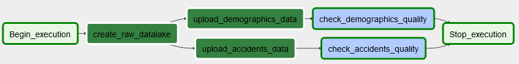
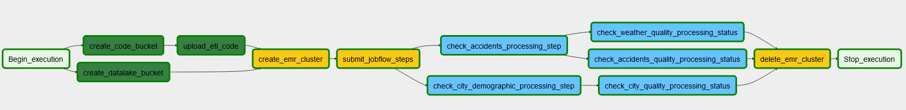

=====================================================================
Accident Analytics - DE/ND Capstone Project
=====================================================================

:Authors:
    oschmi

:Version: 0.1 of 2020/04

***********************************************************************************************************************
Purpose
***********************************************************************************************************************

This is a capstone project for the Udacity DataEngineering Nanodegree. In this project, lessons learned and technologies
from the courses are applied.

The idea behind this project is to create an optimized data lake which enables users to analyse accident data from the US.
Therefore, we process raw data into and store the results in our optimized data lake on S3.

******************************************************************
Data References
******************************************************************

In this project, we use two datasets:

- US Accidents (~3.0 million records, CSV) (`Accidents Source <https://www.kaggle.com/sobhanmoosavi/us-accidents>`_)
  ::

    This is a countrywide car accident dataset, which covers 49 states of the United States.
    The accident data are collected from February 2016 to December 2019, using several data providers...

- US demographics ( records, JSON) (`Demographics Source <https://public.opendatasoft.com/explore/dataset/us-cities-demographics/>`_)
  ::

    Census data from 2015. Containing city demographics data of cities with a population of >=65.000.

Data Exploration
=======================================================================================================================
Firstly, we need to review the data sets to identify possible quality issues and how to handle them.

US Accidents
-----------------------------------------------------------------------------------------------------------------------
The quality of the US Accidents dataset is excellent. However, it contains a lot of columns,
which we are not going to analyze. We are only utilizing a subset of columns in our analytics lake to keep the fact table as clean as possible.
We only use weather and accident related information while ignoring fine grained geographic information like street names or the side of the street.
Nevertheless we include this information in a raw/staging lake to keep this information if they become relevant in the future.

Hence, we store the raw dataset in a corresponding S3 bucket, before extracting relevant information.

Demographics
-----------------------------------------------------------------------------------------------------------------------
Data of the Demographics dataset includes duplicate regarding the pair (city, state), because it contains the tuple (city, state, race, count) is unique in each row.
However, we are not interested in ethnicity count and only include more general information about the population.
Hence, we drop duplicates on the pair (city, state). Furthermore, this dataset includes only cities with a population
of over 65.000. Due to this fact, we drop some of the accidents which happened in smaller counties while joining both datasets.

***************************************************************
Data Models
***************************************************************
The data will be modeled in a data lake on S3.

Raw Data Lake
=================================================================
Our raw lake stores the ground truth data on which we perform ETL jobs to gain our analytics lake.
We keep this ground truth data, in case we want to change our analytics lake later on. Therefore, it is important to
know the ground truth.

We store this lake as a S3 bucket with subfolders (prefixes) for each data set. Additionally, we split the accidents
dataset due to ints size into smaller parts (e. g. 10.000 accidents). This results in the following bucket structure:

.. code-block:: raw

bucket-name
├── accidents
│   ├── accidents_0_to_10000.csv
│   ├── ...
│   └── accidents_2970000_to_2980000.csv
└── demographics
    └── us-cities-demographics.json

Analytics Lake
=================================================

This data lake contains data ready for analytics. The data is prepared, compressed and paritioned by certain columns to allow for fast query times.
We are constructing a star schema with 1 fact table and 2 dimension tables.

Fact table
---------------------
- accidents
    - accident_id; string; unique identifier of the accident record; Primary Key
    - datetime; datetime; shows start time of the accident in local time zone
    - severity; int; shows the severity of the accident, a number between 1 and 4
    - distance; int; the length of the road extent affected by the accident
    - description; string; shows natural language description of the accident
    - temperature: Shows the temperature (in Fahrenheit)
    - wind_speed; int; shows wind speed (in miles per hour)
    - humidity; decimal; shows the humidity (in percentage)
    - pressure; decimal; shows the air pressure (in inches)
    - visibility; decimal; shows visibility (in miles)
    - precipitation; int; shows precipitation amount in inches, if there is any.
    - city_id; int; city identifier; Foreign Key
    - weather_condition_id; int; identifier; Foreign Key

Dimension tables
-----------------------
- cities
    - city_id; int; unique id of city; Primary Key, auto-incremented
    - city_name; string; name of the city
    - state_code; string; 2-letter code of the state
    - total_population; int: total population of the city
    - average_household_size; float: average household size of the city
    - median_age; float: median age of the city
    - number_of_veterans; int: number of veterans living in the city

- weather_conditions
    - weather_condition_id; int; identifier; Primary Key
    - condition; string; shows the weather condition (rain, snow, thunderstorm, fog, etc.)
    - wind_direction; string; shows the wind_direction
    - airport_code; string; airport code of the nearest weather station

S3 Structure
------------------------

Each dir contains parquet files.

.. code-block:: raw

bucket-name
├── accidents
│   ├── ...
│   ├── ...
│   └── ...
├── weather_conditions
│   ├── ...
│   ├── ...
│   └── ...
└── cities
    ├── ...
    ├── ...
    └── ...

Airflow Data Pipelines
==================================================================

We use two DAGs as data pipelines:

1. Uploading raw data to S3:

2. Performing ETL to gain an optimized analytics lake with Spark:

***************************************************
Getting Started
***************************************************

Prerequisites
===================================================

- Docker
- `Poetry <https://python-poetry.org/>`_

Project Structure
===================================================

AWS
======================================================

Airflow
======================================================

Usage
======================================================

**********************************************************
Project Discussion
**********************************************************

